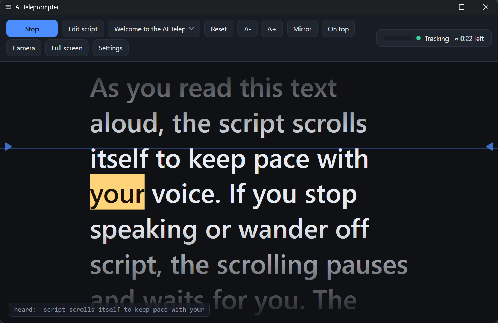

# TalkPrompter

A teleprompter for Windows that listens to your voice and scrolls the script for you.

You read, it follows. If you stop talking or go off script, it waits for you. When you continue, it picks up right where you left off. Everything runs on your computer, so your voice never leaves your machine.

<picture>
  <source media="(prefers-color-scheme: dark)" srcset="docs/screenshot-dark.png">
  <source media="(prefers-color-scheme: light)" srcset="docs/screenshot-light.png">
  
</picture>

## Why I built this

I record a lot of tutorial videos and I was tired of teleprompters that scroll at a fixed speed. I always had to chase the text or wait for it to catch up. So I built one that simply follows my voice.

## Download

Get the latest **TalkPrompter-win-Setup.exe** from the [Releases page](https://github.com/Sven-Bo/talkprompter/releases/latest) and run it. The app keeps itself up to date automatically.

You need the .NET 8 Desktop Runtime. Windows will offer to install it if it is missing.

On the first start the app offers to download a small voice pack (about 40 MB, English or German). That is the part that understands your voice. One click and you are done.

## Free version and license

You can try everything for free. The free version follows your voice on scripts up to 200 words, which is plenty to see if it works for you.

For real videos you buy a license once on [talkprompter.com](https://talkprompter.com) and use it forever, on up to three of your computers. No subscription. Enter the key from your purchase email in Settings and every script length is unlocked.

## How to use it

1. Click **Edit script** and paste your text, or drag a **.docx** or **.txt** file onto the window
2. Click **Start**
3. Read

That is really all. Some handy extras:

- Click any word to jump there
- Press **Space** to start or stop. **Ctrl+Alt+Space** works even while another app is focused
- **Camera** turns the app into a narrow strip at the top of your screen, right under your webcam, so nobody sees your eyes move
- **Mirror** flips the text for teleprompter glass
- Messed up a sentence? Just read it again from where you want. The app follows you back

## Features

- Scrolls automatically by listening to your voice
- Pauses when you pause, no fixed scroll speed
- Works 100% offline, no cloud, no account, no subscription
- Loads Word documents and reloads them live when you save in Word
- Remembers your recent scripts and where you stopped in each one
- Camera mode, mirror mode, full screen, adjustable text size and column width
- Shows the estimated reading time and how much is left

## Support

Found a bug or have an idea? [Open an issue](https://github.com/Sven-Bo/talkprompter/issues) or write to contact@pythonandvba.com.

TalkPrompter is made by Sven Bosau ([Bosau Digital LLC](https://pythonandvba.com)).
